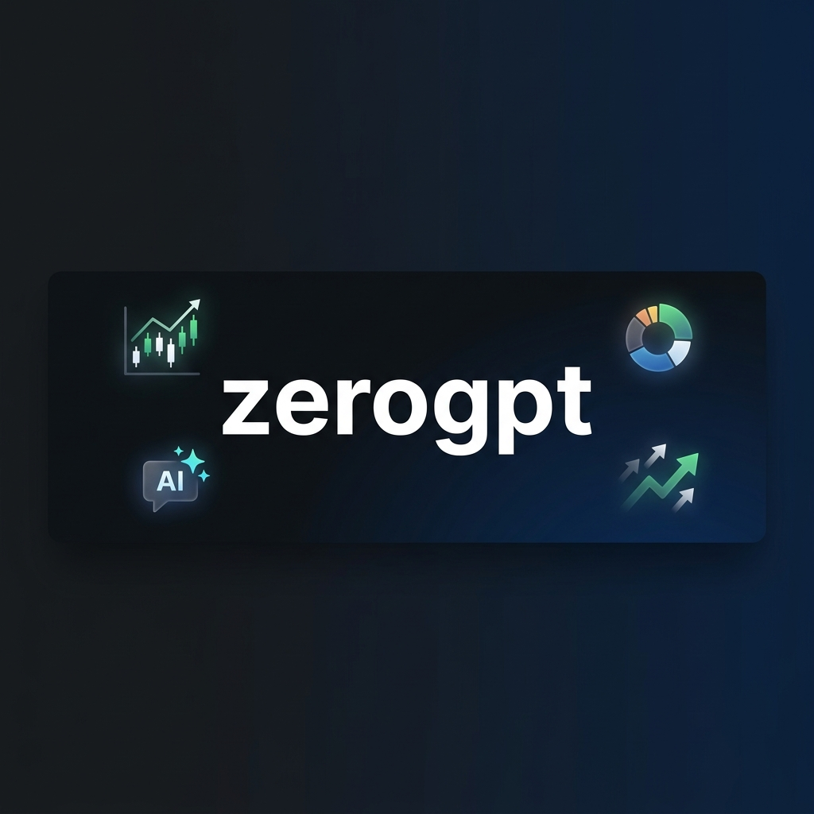

<div align="center">


# zerogpt

**ai-powered portfolio intelligence dashboard for indian equities**

[](https://react.dev)
[](https://www.typescriptlang.org)
[](https://ai.google.dev)
[](LICENSE)

</div>

ai-powered portfolio intelligence dashboard that connects to your zerodha (kite) account. chat with your portfolio, execute trades via natural language, and get real-time analytics — all through a single interface.

```
┌─────────────────────────────────────────────────────────┐
│                    zerogpt frontend                     │
│  ┌──────────┐  ┌──────────────────┐  ┌──────────────┐  │
│  │ sidebar  │  │   dashboard /    │  │  top         │  │
│  │          │  │   chat interface │  │  allocation  │  │
│  │ • dash   │  │                  │  │  panel       │  │
│  │ • hold   │  │  gemini ai ◄──── user query        │  │
│  │ • chart  │  │    │             │  │              │  │
│  │ • report │  │    ▼             │  │              │  │
│  │ • config │  │  trade proposal  │  │              │  │
│  │          │  │    │             │  └──────────────┘  │
│  └──────────┘  │    ▼             │                    │
│                │  passcode modal  │                    │
│                └────────┬─────────┘                    │
│                         │                              │
│                    ┌────▼────┐                          │
│                    │ bridge  │  (your node.js server)   │
│                    │ server  │                          │
│                    └────┬────┘                          │
│                         │                              │
│                    ┌────▼────┐                          │
│                    │  kite   │  zerodha trade api       │
│                    │  api    │                          │
│                    └─────────┘                          │
└─────────────────────────────────────────────────────────┘
```

## what it does

zerogpt is a react frontend that turns your zerodha portfolio into a conversational experience. you talk to gemini, it sees your live holdings, and it can propose + execute trades with passcode verification.

- **ai chat assistant** — ask questions about your portfolio ("which stocks are underperforming?", "sell 10 TCS") and get structured markdown responses powered by gemini 3 pro/flash with automatic model fallback
- **live zerodha sync** — connects to kite trade api via a bridge server, fetches holdings/orders/margins every 5 seconds
- **trade execution** — gemini uses function calling to propose buy/sell orders, you review in a modal and confirm with a security passcode
- **portfolio analytics** — sector allocation pie chart, p&l bar charts, top movers visualization with recharts
- **holdings table** — full holdings breakdown with csv export
- **reports & ledger** — live transaction history from kite with csv export
- **simulation mode** — works without a kite account using mock NSE data (reliance, tcs, infy, hdfc, etc.)
- **settings panel** — configure gemini api key, kite credentials, bridge url, and auto-generates a ready-to-run bridge server script
- **auth system** — local user accounts with per-user settings, chat history, and portfolio data persisted to localStorage

## tech stack

| layer | tech |
|-------|------|
| framework | react 19 + typescript |
| build | vite 6 |
| styling | tailwind css (cdn) |
| ai | google gemini (`@google/genai`) — gemini-3-pro, gemini-3-flash, gemini-flash-latest |
| charts | recharts |
| icons | lucide-react |
| markdown | react-markdown |
| broker api | zerodha kite connect (via bridge server) |

## setup

### prerequisites

- node.js 18+
- a [gemini api key](https://aistudio.google.com/) (required for the ai features)
- a [zerodha kite connect](https://kite.trade/) api key + access token (optional — app works in simulation mode without it)

### run locally

```bash
git clone https://github.com/swarajduttacv/zero.git
cd zero
npm install
```

create a `.env.local` file:

```
GEMINI_API_KEY=your_gemini_api_key_here
```

start the dev server:

```bash
npm run dev
```

app runs at `http://localhost:3000`.

### connecting to zerodha (optional)

the app can't call kite api directly from the browser (cors). you need a small bridge server. go to **settings** in the app — it auto-generates a ready-to-run node.js script with your credentials baked in.

quick version:

```bash
mkdir kite-bridge && cd kite-bridge
npm init -y && npm install express node-fetch@2 cors
# paste the generated script into server.js
node server.js
```

then set the bridge url in settings (e.g. `http://localhost:3000`) and enable live mode.

## project structure

```
├── App.tsx                  # main app shell, routing, state management
├── index.tsx                # react entry point with error boundary
├── index.html               # html shell with tailwind config
├── types.ts                 # typescript interfaces
├── components/
│   ├── AuthScreen.tsx       # login/signup forms
│   ├── ChatInterface.tsx    # ai chat with markdown + trade proposals
│   ├── DashboardStats.tsx   # portfolio summary cards
│   ├── HoldingsView.tsx     # holdings table with csv export
│   ├── AnalyticsView.tsx    # sector allocation + performance charts
│   ├── ReportsView.tsx      # transaction ledger
│   ├── SettingsView.tsx     # api keys, bridge config, security
│   ├── TradeModal.tsx       # order confirmation with passcode
│   ├── Sidebar.tsx          # navigation sidebar
│   ├── Toast.tsx            # notification toasts
│   ├── VisualChart.tsx      # dynamic chart renderer
│   └── ErrorBoundary.tsx    # react error boundary
├── services/
│   ├── geminiService.ts     # gemini ai with model priority queue
│   ├── zerodhaService.ts    # kite api client + mock data
│   └── authService.ts       # localStorage auth + user management
├── package.json
├── vite.config.ts
└── tsconfig.json
```

## how the ai works

the gemini service uses a **priority queue** pattern — it detects whether your message is a "heavy" task (trading, forecasting) or a "light" task (info, summary) and routes to the appropriate model tier:

- **heavy tasks** → gemini-3-pro → gemini-3-flash → gemini-flash-latest
- **light tasks** → gemini-3-flash → gemini-flash-latest

if a model returns 429/503/404, it automatically falls back to the next one. trade intents trigger gemini's function calling (`propose_trade` tool) which surfaces a structured order for you to review.

## ⚠️ disclaimer

this project is for **educational and personal use only**. it is not financial advice.

- the authors are not responsible for any financial losses incurred from using this tool
- always verify trade details before confirming execution
- the simulation mode uses hardcoded mock data and does not reflect real market conditions
- never share your kite api credentials or access tokens publicly
- use at your own risk

## license

[MIT](./LICENSE) © Swaraj Dutta 2025–2026
